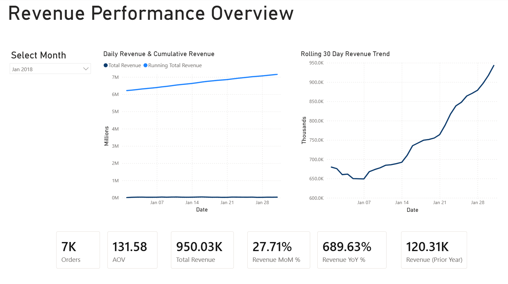
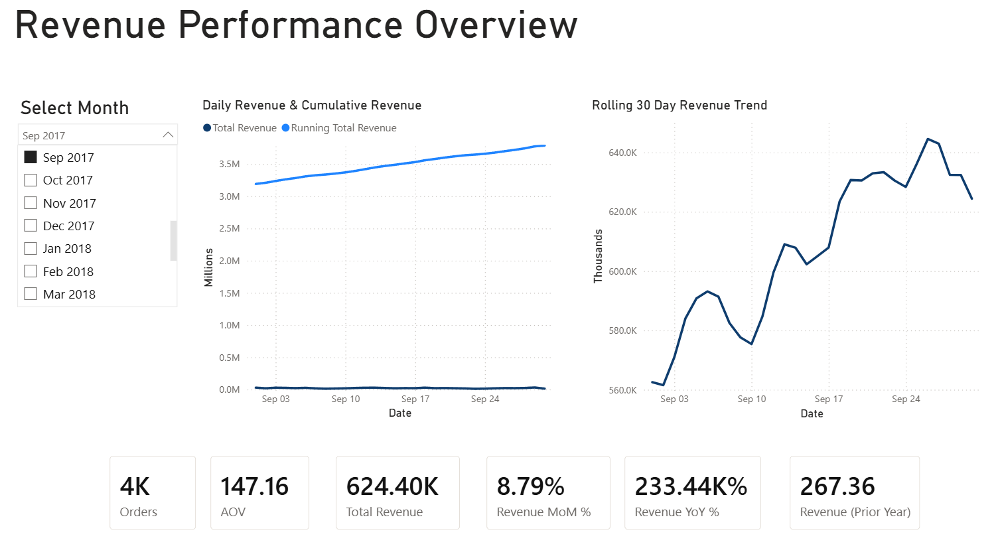
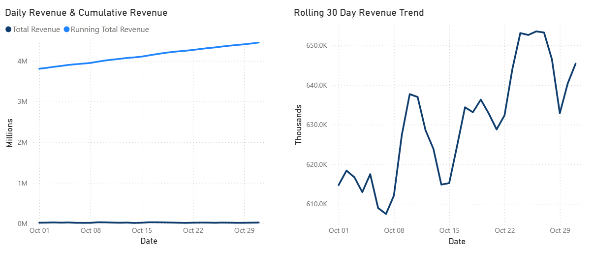
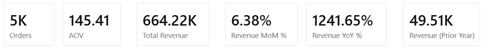

# Revenue Performance Analytics (Power BI)

This project analyzes revenue performance trends using transactional sales data from the Olist e-commerce dataset.

The dashboard focuses on daily revenue behavior, cumulative growth, rolling trends, and time-based KPIs to support data-driven decision-making.

The analysis was built in Power BI using a star-schema data model and custom DAX measures for time intelligence calculations.

---

## Dashboard Preview



---

## Business Questions Answered
- How is revenue trending day-over-day?
- Is cumulative revenue growth accelerating or flattening?
- How does recent performance compare to the prior month and prior year?
- Are recent gains sustainable based on rolling trends?

---

## Key KPIs
- Total Revenue
- Orders
- Average Order Value (AOV)
- Revenue Month-over-Month%
- Revenue Year-over-Year%
- Revenue (Prior Year)

All KPIs dynamically respond to date filters.

---

## Dashboard Overview

### Revenue Performance Overview
Purpose: High-level snapshot of revenue health for a selected month.

Includes:

- Daily Revenue vs. Running Total Revenue
- Rolling 30-Day Revenue Trend
- KPI cards for MoM%, YoY%, AOV, Orders

Screenshot:


---

### Month Filter Interaction
Purpose: Demonstrates interactive filtering using a clean Month slicer.

Highlights:

- Proper month labeling and sorting
- Cross-filtering across all visuals
- UX-focused slicer design

Screenshot:


---

### Daily & Cumulative Revenue
Purpose: Compare short-term fluctuations against long-term growth.

Insights:

- Identifies volatility vs. trend stability
- Shows how daily noise contributes to cumulative performance

Screenshot:


---

### Rolling 30-Day Revenue Trend
Purpose: Smooths daily volatility to highlight momentum shifts.

Insights: 

- Identifies sustained growth or decline
- Useful for forecasting and performance monitoring

Screenshot:


---

## Data Model
The dashboard uses a star schema design:
- Fact Table
	- Fact_OrderItems
- Dimension Tables
	- Dim_Date
	- Dim_Customers
	- Dim_Products
	- Dim_Sellers

This structure enables efficient filtering and accurate time-based calculations.

---
## Design Decisions

Several design choices were made to improve readability and analytical clarity:

- A **star schema** was used to improve performance and simplify filtering
- Daily revenue and cumulative revenue were displayed together to highlight both short-term volatility and long-term growth
- A **rolling 30-day trend** was included to smooth daily fluctuations and reveal momentum shifts
- KPI cards were aligned and standardized to support quick executive-level scanning
- A month slicer was used to enable intuitive time filtering
---

## DAX Measures
Core DAX measures are documented separately for clarity and version control:

#### DAX Documentation:
/dax/dax_measures.md

Includes:
- Total Revenue
- Orders
- AOV
- Running Total Revenue
- Revenue MoM%
- Revenue YoY%

---

## Tools Used
- Power BI Desktop
- DAX (Time Intelligence)
- Star Schema Modeling
- Markdown Documentation

---

## Key Takeaways
- Revenue shows consistent cumulative growth with short-term volatility.
- Rolling 30-day trends provide clearer insight than daily figures alone.
- MoM and YoY metrics highlight strong growth but require context to avoid misinterpretation.
- Clean slicer design significantly improves dashboard usability.

---

## How to Run This Project

1. Download or clone the repository
2. Open the `.pbix` file located in the `/powerbi/` folder using Power BI Desktop
3. Ensure the dataset is loaded properly
4. Use the Month slicer to explore revenue trends and KPI changes
5. Refer to `/dax/dax_measures.md` for the full list of DAX calculations used in the dashboard

---

## Project Structure
```text
Olist_Sales_Analytics/
│
├── data/
├── dax/
│   └── dax_measures.md
├── docs/
├── powerbi/
├── screenshots/
│   ├── 01_revenue_performance_overview.png
│   ├── 02_month_filter_interaction.png
│   ├── 03_daily_and_cumulative_revenue.png
│   └── 04_rolling_30_day_revenue.png
```
---

## Assumptions & Limitations

- Revenue is calculated using order item price values
- Refunds and discounts are not modeled in this analysis
- Rolling 30-day calculations may be affected by partial periods near dataset boundaries
- The dataset represents historical transactions and may not reflect current market conditions


